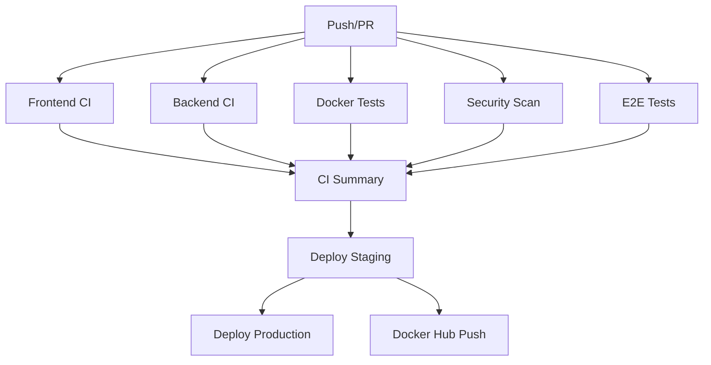

# GitHub Actions Workflows

This directory contains GitHub Actions workflows for automated testing, security scanning, and deployment of the Todo Reminder application.

## Workflows Overview

### 🔄 CI Pipeline (`ci.yml`)
**Triggers:** Push to main/develop, Pull requests, Manual dispatch
**Purpose:** Complete continuous integration pipeline that runs all tests

**Jobs:**
- **Frontend**: Linting, type checking, build validation
- **Backend**: Unit tests, health checks, API testing
- **Docker**: Container build and integration tests
- **Security**: Dependency vulnerability scanning
- **E2E**: End-to-end testing with Playwright
- **Summary**: Consolidated test results

### 🎯 Frontend CI (`frontend-ci.yml`)
**Triggers:** Changes to frontend code
**Purpose:** Dedicated frontend testing and validation

**Features:**
- ESLint code quality checks
- TypeScript type checking
- Build validation
- Multi-Node.js version testing (18, 20)
- Build artifact upload
- Preview deployment for PRs

### 🔧 Backend CI (`backend-ci.yml`)
**Triggers:** Changes to backend code
**Purpose:** Backend-specific testing and validation

**Features:**
- Unit test execution
- Health endpoint testing
- API endpoint validation
- Security audit
- Multi-Node.js version testing (18, 20)

### 🐳 Docker Tests (`docker-test.yml`)
**Triggers:** Changes to Docker files
**Purpose:** Container and Docker Compose testing

**Features:**
- Individual container build tests
- Docker Compose integration tests
- Service communication validation
- Container health checks
- Multi-service orchestration testing

### 🎭 End-to-End Tests (`e2e-test.yml`)
**Triggers:** Push/PR to main/develop, Manual dispatch
**Purpose:** Full application testing

**Features:**
- Playwright browser automation
- Frontend-backend integration testing
- API endpoint validation
- Responsive design testing
- Cross-browser compatibility

### 🔒 Security Scanning (`security-scan.yml`)
**Triggers:** Push/PR to main/develop, Daily schedule
**Purpose:** Comprehensive security validation

**Features:**
- Dependency vulnerability scanning
- CodeQL static analysis
- Semgrep security rules
- Docker image security scanning (Trivy)
- Secrets detection (TruffleHog)
- License compliance checking

### 🚀 Deployment (`deploy.yml`)
**Triggers:** Push to main, Manual dispatch
**Purpose:** Automated deployment to staging and production

**Features:**
- Staging environment deployment
- Production environment deployment
- Docker Hub image publishing
- Post-deployment health checks
- Environment-specific configurations

## Workflow Dependencies



## Environment Variables

### Required Secrets
- `DOCKER_USERNAME`: Docker Hub username for image publishing
- `DOCKER_PASSWORD`: Docker Hub password/token

### Optional Environment Variables
- `SMTP_HOST`: SMTP server for email testing
- `SMTP_USER`: SMTP username for testing
- `SMTP_PASS`: SMTP password for testing

## Usage

### Running Tests Locally
```bash
# Frontend tests
npm run lint
npm run build
npx tsc --noEmit

# Backend tests
cd backend
npm test
npm start

# Docker tests
docker-compose up --build
```

### Manual Workflow Dispatch
1. Go to Actions tab in GitHub
2. Select the desired workflow
3. Click "Run workflow"
4. Choose branch and options
5. Click "Run workflow"

### Monitoring Workflows
- Check the Actions tab for workflow status
- Review logs for detailed error information
- Monitor security alerts in the Security tab
- Check deployment status in Environments

## Best Practices

### For Developers
- Always run tests locally before pushing
- Keep dependencies updated
- Follow the established code style
- Write meaningful commit messages

### For Maintainers
- Review failed workflows promptly
- Monitor security scan results
- Keep workflow configurations updated
- Document any new requirements

## Troubleshooting

### Common Issues
1. **Build Failures**: Check Node.js version compatibility
2. **Docker Issues**: Verify Dockerfile syntax and dependencies
3. **Security Alerts**: Review and update vulnerable dependencies
4. **E2E Failures**: Check for UI changes that break selectors

### Getting Help
- Check workflow logs for detailed error messages
- Review the application documentation
- Create an issue for persistent problems
- Consult the team for deployment issues

## Workflow Status Badges

Add these badges to your README:

```markdown


```